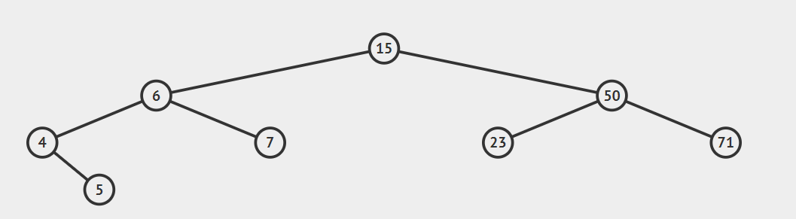

# 学习笔记

## 1. 二叉树的相关知识
### 1.0 种类
#### 满二叉树
- 满二叉树：如果一棵二叉树只有度为0的结点和度为2的结点，并且度为0的结点在同一层上，则这棵二叉树为满二叉树
#### 完全二叉树
- 完全二叉树：除了最底层节点可能没填满外，其余每层节点数都达到最大值，并且最下面一层的节点都集中在该层最左边的若干位置。若最底层为第 h 层，则该层包含 1~ 2h 个节点
### 1.1 二叉搜索树
- 二叉搜索树是一个有序树
- 若它的左子树不空，则左子树上所有结点的值均小于它的根结点的值
- 若它的右子树不空，则右子树上所有结点的值均大于它的根结点的值
- 它的左、右子树也分别为二叉排序树

### 1.2 平衡二叉搜索树
- 又被称为AVL（Adelson-Velsky and Landis）树，
- 且具有以下性质：
    - 它是一棵空树或它的左右两个子树的高度差的绝对值不超过1，
    - 并且左右两个子树都是一棵平衡二叉树。
### 1.1 java的代码实现
```java

public class TreeNode {
    int val;
    TreeNode left;
    TreeNode right;

    TreeNode() {
    }

    TreeNode(int val) {
        this.val = val;
    }

    TreeNode(int val, TreeNode left, TreeNode right) {
        this.val = val;
        this.left = left;
        this.right = right;
    }
}

```

### 1.2 三种遍历方式
- 前序遍历：根-左-右，这种遍历方式，第一个元素是根节点
- 中序遍历：左-根-右，[图解方式](https://visualgo.net/zh/bst)
- 后序遍历：左-右-根，这种遍历方式，最后一个元素是根节点
- 三种遍历方式都是在**先左后右**的情况下，调整**根**的出现位置。


- 递归（recursion）：递归常被用来描述以自相似方法重复事物的过程，在数学和计算机科学中，指的是在函数定义中使用函数自身的方法。（A调用A）

迭代（iteration）：重复反馈过程的活动，每一次迭代的结果会作为下一次迭代的初始值。（A重复调用B）

### 1.3 深度优先搜索（DFS）
#### 1.3.1 递归写法

```java
public List<List<Integer>> levelOrder(TreeNode root) {
    List<List<Integer>> allResults = new ArrayList<>();
    if(root==null){
        return allResults;
    }
    travel(root,0,allResults);
    return allResults;
}


private void travel(TreeNode root,int level,List<List<Integer>> results){
    if(results.size()==level){
        results.add(new ArrayList<>());
    }
    results.get(level).add(root.val);
    if(root.left!=null){
        travel(root.left,level+1,results);
    }
    if(root.right!=null){
        travel(root.right,level+1,results);
    }
}
```

#### 1.3.2 非递归写法
```java
void dfs(Node* root) {
  map<int, int> visited;
  if(!root) return ;

  stack<Node*> stackNode;
  stackNode.push(root);

  while (!stackNode.empty()) {
    Node* node = stackNode.top();
    stackNode.pop();
    if (visited.count(node->val)) continue;
    visited[node->val] = 1;


    for (int i = node->children.size() - 1; i >= 0; --i) {
        stackNode.push(node->children[i]);
    }
  }

  return ;
}
```
### 1.4 广度优先搜索（BFS）
#### 1.4.1 递归写法
```java
public List<List<Integer>> levelOrder(TreeNode root) {
    List<List<Integer>> allResults = new ArrayList<>();
    if (root == null) {
        return allResults;
    }
    Queue<TreeNode> nodes = new LinkedList<>();
    nodes.add(root);
    while (!nodes.isEmpty()) {
        int size = nodes.size();
        List<Integer> results = new ArrayList<>();
        for (int i = 0; i < size; i++) {
            TreeNode node = nodes.poll();
            results.add(node.val);
            if (node.left != null) {
                nodes.add(node.left);
            }
            if (node.right != null) {
                nodes.add(node.right);
            }
        }
        allResults.add(results);
    }
    return allResults;
}
```
## 2. 贪心算法
- 定义：一种在每一步选择中都采取在当前状态下最好或最优（即最有利）的选择，从而希望导致结果是**全局最好**或**最优**的算法。
- 贪心算法与动态规划的不同在于：他对每个子问题的解决方案都做出选择，不能回退。
- 动态规划则会保存以前的运算结果，并根据以前的结果，对当前进行选择，右回退功能。
- 简答记忆：
    - 贪心：当下做局部最优判断，不会回退
    - 回溯：能够回退
    - 动态规划：最优判断 + 回退

## 3. 二分查找(binary search algorithm)
- 定义：一种在`有序数组`中查找某一特定元素的搜索算法。
- 前提：
    - 1. 目标函数单调性(单调递增或递减)
    - 1. 存在上下界
    - 1. 能够通过索引访问
- 怎么写：
    - 搜索过程从数组中间开始，如果中间元素正好是要查找的元素，则查找结束；
    - 如果某一特定元素大于或者小于中间元素，则在数组大于或者小于中间元素的那一半查找，而且跟开始一样从中间元素开始比较。
    - 如果在某一步骤数组为空，则代表找不到。这种查找算法每一次都使查找范围小一半。   
### 代码模板
```java
public static int binarySearch(int[] arr, int start, int end, int hkey){
    if (start > end)
        return -1;

    int mid = start + (end - start)/2;    //防止溢位
    if (arr[mid] > hkey)
        return binarySearch(arr, start, mid - 1, hkey);
    if (arr[mid] < hkey)
        return binarySearch(arr, mid + 1, end, hkey);
    return mid;  

}
```


# 作业：
## 简单：
- 柠檬水找零（亚马逊在半年内面试中考过）
- 买卖股票的最佳时机 II （亚马逊、字节跳动、微软在半年内面试中考过）
- 分发饼干（亚马逊在半年内面试中考过）
- 模拟行走机器人
- 使用二分查找，寻找一个半有序数组 [4, 5, 6, 7, 0, 1, 2] 中间无序的地方
说明：同学们可以将自己的思路、代码写在第 4 周的学习总结中
## 中等：
- 单词接龙（亚马逊在半年内面试常考）
- 岛屿数量（近半年内，亚马逊在面试中考查此题达到 350 次）
- 扫雷游戏（亚马逊、Facebook 在半年内面试中考过）
- 跳跃游戏 （亚马逊、华为、Facebook 在半年内面试中考过）
- 搜索旋转排序数组（Facebook、字节跳动、亚马逊在半年内面试常考）
- 搜索二维矩阵（亚马逊、微软、Facebook 在半年内面试中考过）
寻找旋转排序数组中的最小值（亚马逊、微软、字节跳动在半年内面试中考过）
## 困难
- 单词接龙 II （微软、亚马逊、Facebook 在半年内面试中考过）
- 跳跃游戏 II （亚马逊、华为、字节跳动在半年内面试中考过）

#学号: G20200607010920
#姓名: 张君毅
#班级:19期
#语言:java
#作业链接: https://github.com/junyi0124/algorithm019/blob/main/Week_04
#总结链接: https://github.com/junyi0124/algorithm019/blob/main/Week_04/README.md